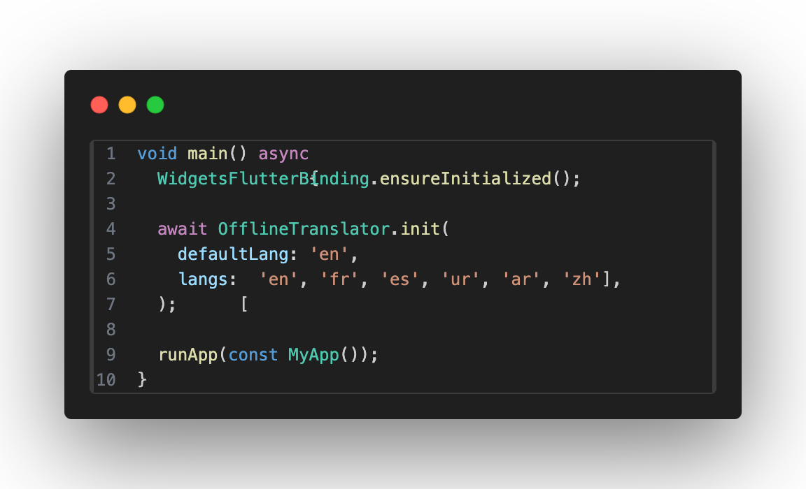
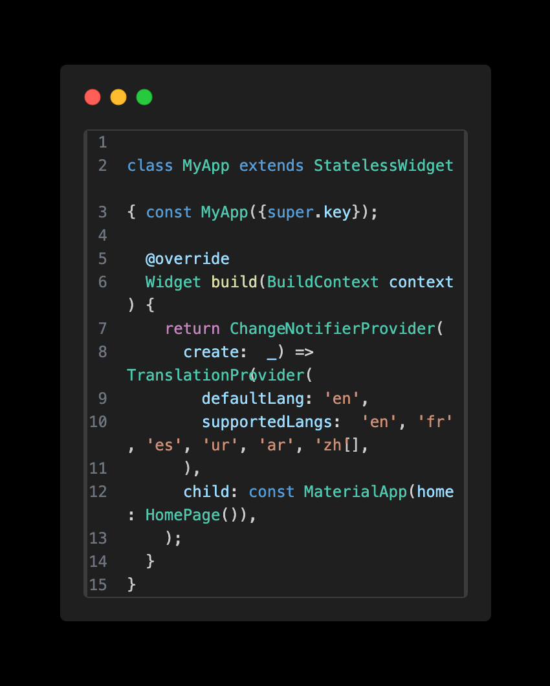
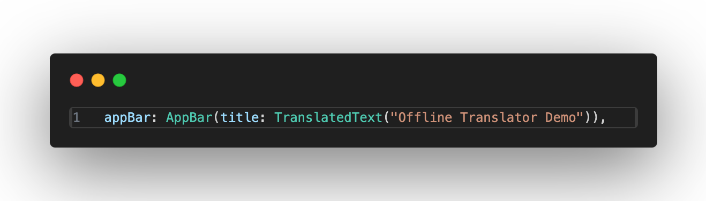

# 🈳 Offline Translator

**A Flutter package for completely offline translation** — no internet, no external files, fully self-contained.  

   

## 🚀 Features

- **Offline translations**: Works without internet.  
- **Multiple languages supported**: English, French, Spanish, Urdu, Arabic, Chinese (`en`, `fr`, `es`, `ur`, `ar`, `zh`).  
- **No extra files required**: JSON/ARB-free.  
- **Easy integration**: Works like Flutter’s `Text()` widget.  
- Lightweight, fast, and reliable.  

## 🎯 Getting Started

### 1️⃣ Add Dependency

dependencies:
  offline_translator: ^0.0.1

### 2️⃣ Initialize Translator

### 3️⃣ Wrap App with Provider

# usage dynamically
 
 

## 💡 Key Advantages

* **Dynamic placeholders**: Easily replace text like `"Welcome {name}"`.
* **Offline-first**: Ideal for apps with no internet connectivity.
* **android & iOS**: Works on android & iOS 16+ and all Flutter-supported platforms.

## 🏆 Why Choose Offline Translator?

✅ No network dependency
✅ For dynamic data/text
✅ Multi-language support
✅ Fast, lightweight, and simple API
✅ Perfect for mobile apps requiring offline capabilities

**Supported Languages:**  

 English   en    🇺🇸 
 French    fr    🇫🇷 
 Spanish   es    🇪🇸 
 Urdu      ur    🇵🇰 
 Arabic    ar    🇸🇦 
 Chinese   zh    🇨🇳 

Note: we are adding more languages and working on performance and enhancement

Made with ❤️ by Ahmed Khushal Khan

